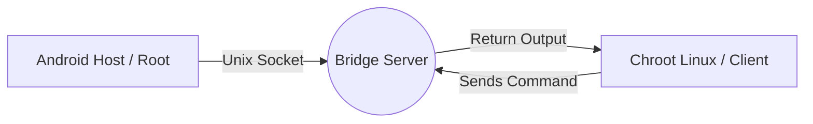

# NativeBridge

> **Break the Chroot isolation. Control Android Host directly from your Linux Environment.**

[](https://www.rust-lang.org/)
[](LICENSE)
[](https://developer.android.com/)

**NativeBridge** establishes a direct, high-performance communication channel between a Chrooted Linux Environment (Like Ubuntu/Debian on Android) and the Android Host System.

## Why NativeBridge?

By default, a Chroot Environment is strictly isolated. It lives in a separate filesystem "jail" (/data/local/tmp/chroot) and **cannot access the Android System**, hardware inputs, or global settings.

**NativeBridge solves this by creating a secure tunnel (Unix Domain Socket) that allows you to:**

- **Bypass Isolation:** Execute commands on the Android System directly from your Chroot Terminal.
- **Access Root Features:** Perform system-level tasks (Screenshots, Input Injection, Hardware Control) that are normally impossible from within Chroot.
- **Zero Latency:** Built with **Rust** and **Unix Sockets** for instant execution, perfect for automation or input mapping.

## Architecture



- **Server**: Runs on Android Host (Root). it listens for incoming requests.
- **Client**: Runs inside the Chroot Environment. it sends commands to the Server via the shared socket.

## Prerequisites

- **Rooted Android Device** (KernelSu / Magisk / Apatch).
- **Chroot Environment** (Ubuntu, Debian, Kali, Fedora, etc).
- **Rust Toolchain** (Optional: For build NativeBridge, with `musl` target support for static linking).

## Building

Clone the repo and build statically using Musl to ensure compatibility across different environments:

```bash
# Add musl target for ARM64
rustup target add aarch64-unknown-linux-musl

# Build release Binaries
cargo build --release --target aarch64-unknown-linux-musl
```

## installation

### Download & Move to your Chroot Environment.
Simply just download from release and Move

1. Download bridge_server & andro from release
2. Move bridge_server to /data/local/tmp/
3. Give 755 Permission
6. Run bridge-server in background (/data/local/tmp/bridge_server &)
4. Move andro to /usr/local/bin in chroot folder
5. Give 755 Permission
6. Usage

### Build From Source
This Installation if Build from Source

### 1. Server (Android Host)
Move the `bridge_server` binary to a location accessible by Root (e.g., `/data/local/tmp`).

```bash
# in Chroot Environment
cp ~/NativeBridge/target/aarch64-unknown-linux-musl/release/bridge_server /tmp/bridge_server

# in Termux or Android Shell
su
cp /data/local/tmp/{yourchrootnamefolder}/tmp/bridge_server /data/local/tmp/
chmod +x /data/local/tmp/bridge_server

# Run in background
/data/local/tmp/bridge_server &
```

### 2. Client (Chroot)
Move the `bridge_client` binary to you binary path inside the Chroot Environment.

```bash
# in Chroot Shell
sudo cp ~/NativeBridge/target/aarch64-unknown-linux-musl/release/bridge_client /usr/local/bin/andro
sudo chmod +x /usr/local/bin/andro
```

## Usage

Simply call the client binary (alias `andro`) followed by the command you want to execute on the Android Host.

```bash
# Check User Identity
andro "id"

# Take a Screenshots
andro "screencap -p > /data/local/tmp/capture.png (or /sdcard)"

# Simulate Touch Input (Tap coordinates X Y)
andro "input tap 500 500"

# Reboot Device
andro "reboot"
```

## Potential Use Cases

- **Hybrid Workflow:** Copy/Paste between Androi and Linux seamlessly.
- **Gaming/input Mapping:** Map generic Linux Keyboard inputs to Android touch events instantly.
- **Automation:** Control Android system setting (Change IP every 1 second, Airplane Mode, Data Cellular), Auto check-in / login Apps via Linux scripts (Python, C++, Rust, etc).

## License

This project is licensed under the MIT License - see the [LICENSE](LICENSE) file for details.
