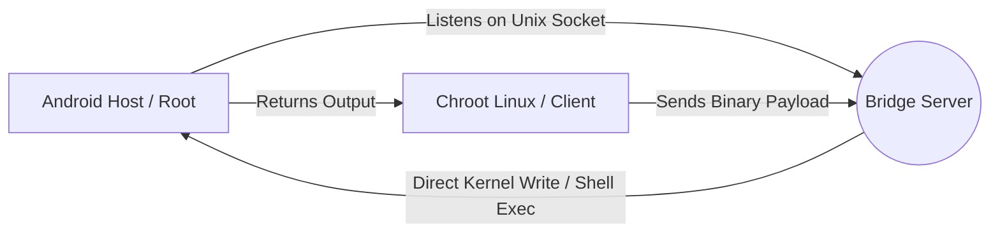

# NativeBridge

> **Break the Chroot isolation. Control Android Host directly from your Linux Environment.**

[](https://www.rust-lang.org/)
[](LICENSE)
[](https://developer.android.com/)

**NativeBridge** establishes a direct, high-performance communication channel between a Chrooted Linux Environment (like Ubuntu/Debian via Termux) and the Android Host System.

## Why NativeBridge?

By default, a Chroot Environment is strictly isolated. It lives in a separate filesystem "jail" (e.g., `/data/local/tmp/chrootubuntu`) and **cannot access the Android System**, hardware inputs, or global settings.

**NativeBridge solves this by creating a secure tunnel (Unix Domain Socket) that allows you to:**

- **Bypass Isolation:** Execute commands on the Android System directly from your Chroot Terminal.
- **Direct Kernel Injection:** Perform high-speed input injection (Tap/Swipe) by writing directly to `/dev/input/event*`, bypassing the heavy Android Framework (Java) for near zero-latency.
- **Protocol Optimization:** Uses **Bincode** serialization instead of JSON for minimal overhead.
- **Modular:** Built with Rust workspaces and feature flags to keep binaries small and efficient.

## Architecture



- **Server (`bridge_server`)**: Runs on Android Host (Root). Listens for incoming requests via a shared socket inside the Chroot path.
- **Client (`andro`)**: Runs inside the Chroot Environment. Sends commands to the Server.

## Prerequisites

- **Rooted Android Device** (KernelSu / Magisk / APatch).
- **Chroot Environment** (Ubuntu, Debian, Kali, Fedora, etc).
- **Rust Toolchain** (Only if building from source).

## Building from Source

Since we want to run these binaries on Android, we must build them statically using `musl`.

### 1. Setup Environment
```bash
# Add musl target for ARM64
rustup target add aarch64-unknown-linux-musl
```

### 2. Compile
You have two options depending on your needs:

**Option A: Standard Build (Exec Only)**
Lightweight, safer, only allows shell execution (`sh -c`).
```bash
cargo build --release --target aarch64-unknown-linux-musl --bin bridge_server
cargo build --release --target aarch64-unknown-linux-musl --bin bridge_client
```

**Option B: Full Build (Direct Input Support)**
Enable `direct_input` feature to allow Tap & Swipe via Kernel Injection.
*> Note: You may need to configure the `/dev/input/eventX` path in `input_manager.rs` before building.*
```bash
cargo build --release --target aarch64-unknown-linux-musl --features "direct_input" --bin bridge_server
cargo build --release --target aarch64-unknown-linux-musl --features "direct_input" --bin bridge_client
```

---

## Installation

### 1. Setup Server (Android Host)
The server must run outside the Chroot, but the binary is currently inside your build folder.

```bash
# [Inside Chroot Terminal]
# Copy binary to a temporary location accessible by Android
cp target/aarch64-unknown-linux-musl/release/bridge_server /tmp/bridge_server
```

Now, open a **separate terminal** (Termux or ADB Shell) that is **NOT** inside Chroot:

```bash
# [Inside Android Termux/ADB]
su
# Move to /data/local/tmp (Exec is allowed here)
cp /data/local/tmp/chrootubuntu/tmp/bridge_server /data/local/tmp/
chmod +x /data/local/tmp/bridge_server

# Run in background
/data/local/tmp/bridge_server &
```
*Tip: Use KernelSU `service.d` to auto-start this on boot.*

### 2. Setup Client (Chroot)
The client lives inside your Chroot environment.

```bash
# [Inside Chroot Terminal]
cp target/aarch64-unknown-linux-musl/release/bridge_client /usr/local/bin/andro
chmod +x /usr/local/bin/andro
```

---

## Usage

Simply call `andro` followed by the subcommand.

### 1. General Execution
Run any command as if you were in the Android Root Shell.
```bash
# Check User Identity
andro exec id
# Output: uid=0(root) gid=0(root) ...

# Check Battery Status
andro exec dumpsys battery

# Reboot Device
andro exec reboot
```

### 2. Direct Input (Kernel Injection)
*Requires build with `--features "direct_input"`*

```bash
# Tap (Instant click at X=500, Y=500)
andro tap 500 500

# Swipe (Scroll down)
# Format: swipe <x1> <y1> <x2> <y2> <duration_ms>
andro swipe 500 1500 500 500 300
```

### 3. Screenshot
Capture the Android screen and save it directly to the Chroot filesystem.
```bash
# Capture and redirect output to a file
andro exec screencap -p > /home/user/capture.png
```

### 4. Utilities
```bash
# Check if server is alive
andro ping

# Show help menu
andro --help
```

## Troubleshooting

**"Connection refused" or "No such file or directory"**
- Ensure `bridge_server` is running on Android Host.
- Ensure the socket path in `main.rs` matches your Chroot mount point (Default: `/data/local/tmp/chrootubuntu/tmp/bridge.sock`).

**Tap/Swipe not working**
- Did you build with `--features "direct_input"`?
- Did you set the correct Touchscreen Device path (e.g., `/dev/input/event2`) in `input_manager.rs` before building? Use `getevent -pl` in Termux to find your specific device event.

## License

This project is licensed under the MIT License - see the [LICENSE](LICENSE) file for details.
